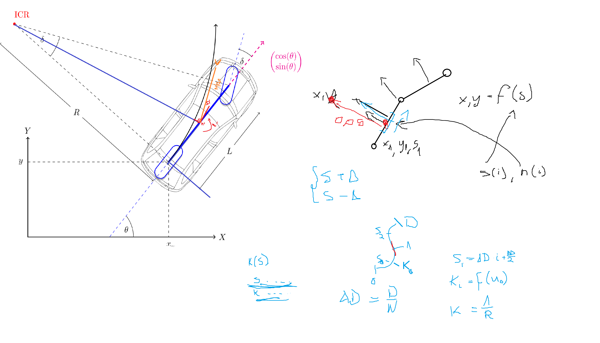

Usage guide:

1. Create virtual environment
```sh
python -m venv venv
```
2. Activate virtual environment
3. Install editable package
```sh
pip install -e .
```
4. Run scripts defined in scripts/*. For example:
```sh
map_generate
```
